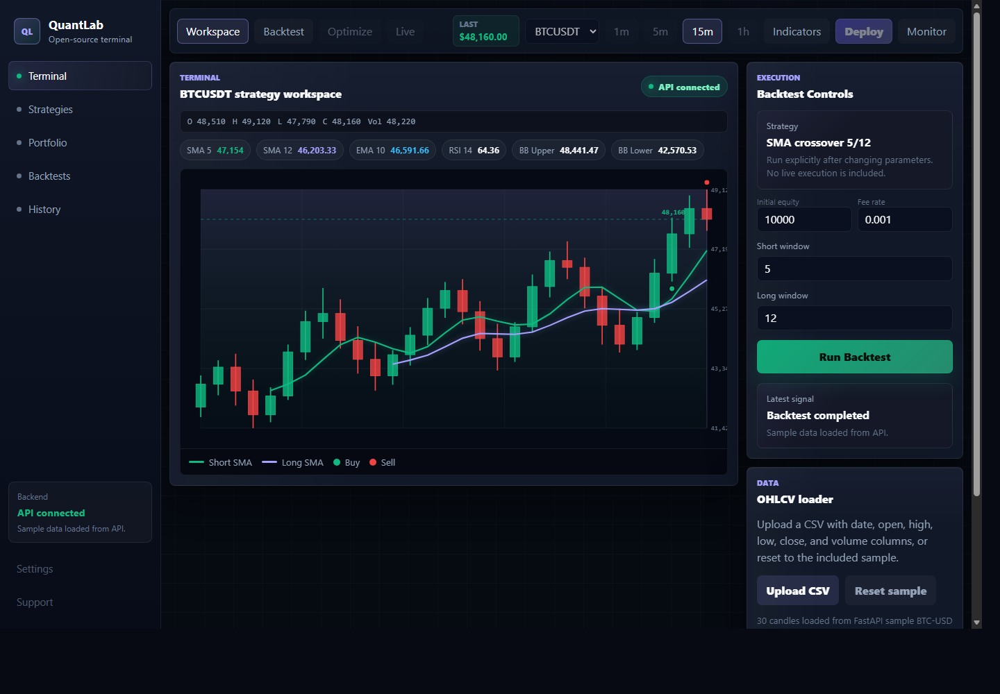
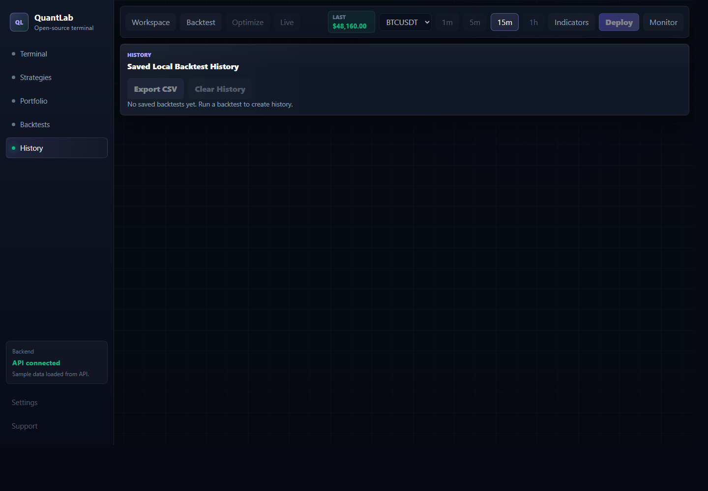

# Frontend Overview

The QuantLab frontend lives in `frontend/`. It is a React + Vite + TypeScript app that presents the FastAPI backend as a dark trading-terminal style workflow.

## Main Screen



The terminal dashboard focuses on the complete MVP path:

- Load sample OHLCV data from the backend.
- Upload validated OHLCV CSV files.
- Toggle visible indicators.
- Run the SMA crossover backtest against the FastAPI API.
- View chart signals, metrics, and the trade log.

## Backtest History



Backtest history is intentionally local-only for this foundation. Successful runs are stored in `localStorage` and can be exported as CSV.

## Frontend Folder

```text
frontend/
  src/
    api/          Backend API client
    backtest/     Local fallback backtest logic
    components/   UI components
    data/         Bundled fallback data
    indicators/   Local fallback indicators
    tests/        Vitest tests
    utils/        Shared TypeScript types and helpers
```

## Local Commands

```bash
cd frontend
npm install
npm run dev
npm test
npm run build
```

The frontend reads `VITE_API_URL`, defaulting to `http://localhost:8000`.
